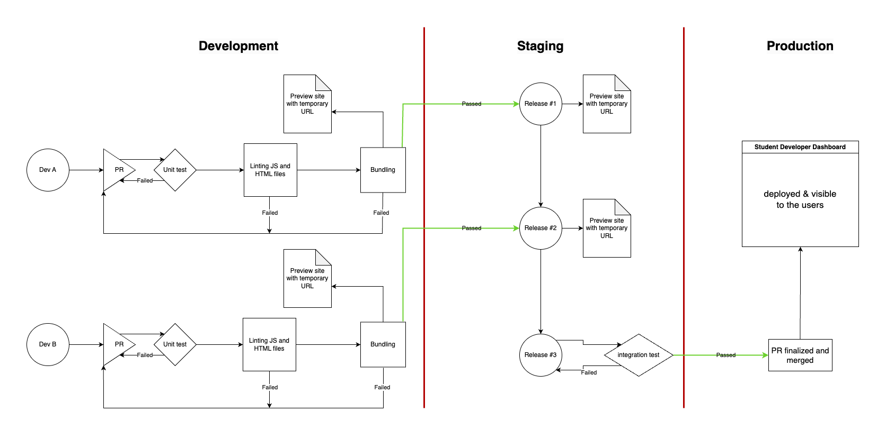

## How to Write Tests and Test

1. Go to `test/` to write sample tests for the new code.
2. Run `npm run test` to run the unit tests

## How to Develop Locally

1. Go to `src/` to start your development
2. Run `npm run start:dev` to start a live server to see new changes in the browser

## How to Build Locally

1. Run `npm run start` to build the bundle to simulate the production build and serve the production build on a live server.
   - The output of this command should show you how to access the build

## All Together

1. Write tests and see them fail
2. Start development
3. Run tests until they all pass
4. Commit changes and create a Pull Request
5. Monitor CI results on GitHub Action
6. If not passed, continue to complete the development
7. If CI passed and CD go through,
   1. gather the link that serves the production bundle from GitHub Action
   2. send it to others to review your changes
8. New changes will be automatically updated in staging environment once merged into `release` branch

- To see the process visually:

</img>
