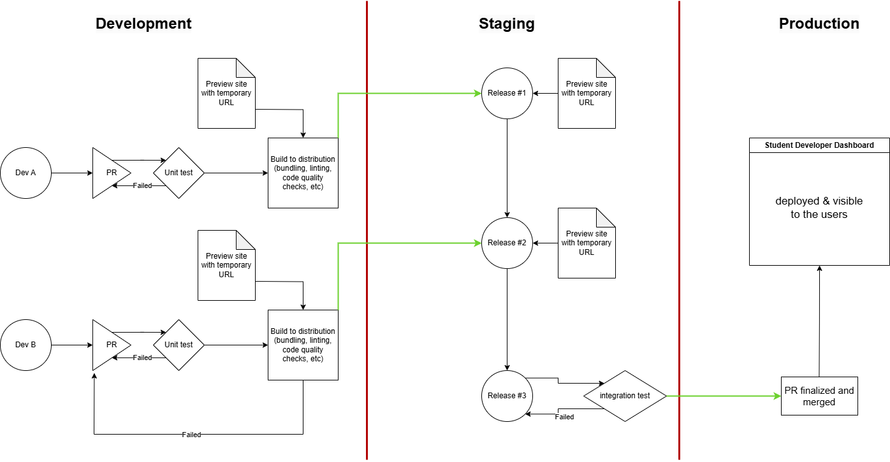

# CI/CD Pipeline Documentation

The CI/CD pipeline is designed to ensure safe integration practices, along with proper developer practices for this project. The general design will include unit testing, integration testing, and linting. Enforcement of these critical tools will be done using GitHub Actions. As a reference, the CI/CD diagram gives a end-to-end view of how the pipeline will operate.

## Current Functionality

Currently, the pipeline supports unit testing for front-end related code (JS, HTML, and CSS). All developers implement new features in developer branches off of the staging environment. 

When a developer creates a pull request, unit tests are run on the new code. If these pass, a live server is deployed using Cloudflare. 

Next, a human reviewer can inspect the code and the preview site and ensure visual consistency and functionality. Once the reviewer approves the pull request, the code is merged with the staging branch. 

After this, the staging branch is merged with the main (production) branch at a given time interval.

### Current Tech Stack

Below is the technology being utilized for the pipeline:
* GitHub Actions
* .yaml
* Shell script for building bundles (terser minify)
* npx
* Cloudflare

The decisions behind using these technologies are detailed in their respective ADRs.

## Future Functionality

In the future, a few key needs have been identified that will be built out. These are listed below in order of priority:

* Linting/style checking testing
* Documentation generation and requirements enforcement
* Integration testing
* Back-end unit testing (database)
